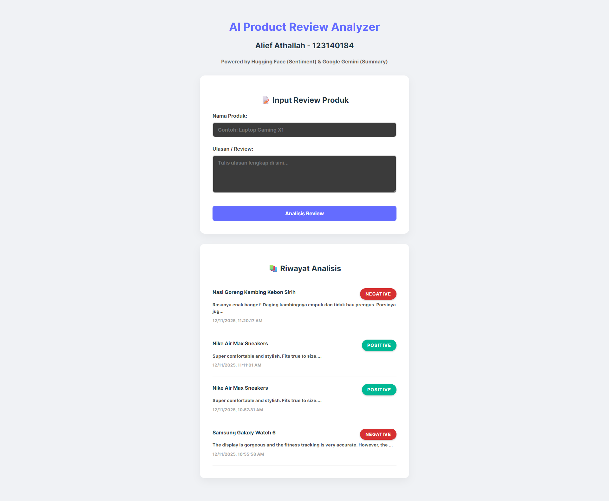

# Tugas Pertemuan 3 (123140184)

Buat aplikasi Product Review Analyzer dengan fitur:

- User dapat input product review (text)
- Analyze sentiment (positive/negative/neutral) menggunakan Hugging Face
- Extract key points menggunakan Gemini
- Display hasil analysis di React frontend
- Save results ke PostgreSQL database

Deliverables:

- Working backend API dengan 2 endpoints:

```bash
POST /api/analyze-review - Analyze new review
GET /api/reviews - Get all reviews
```

- React frontend dengan form input dan results display
- Database integration (SQLAlchemy + PostgreSQL)
- Error handling dan loading states
- Documentation (README.md)

Format Pengumpulan: tugas_individu3.pdf (ada nama, nim dan link github di pdf)

# Dokumentasi Website


