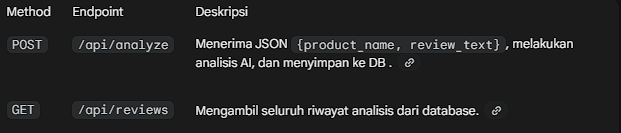

# AI Product Review Analyzer - Backend API

Backend service ini dibangun menggunakan framework **Python Pyramid** yang berfungsi sebagai otak dari aplikasi analisis ulasan produk. Layanan ini mengintegrasikan **Hugging Face Transformers (Local Pipeline)** untuk analisis sentimen dan **Google Gemini API** untuk peringkasan teks.


## Fitur Utama

- **Sentiment Analysis (Offline/Local):** Menggunakan library `transformers` dan model `distilbert-base-uncased-finetuned-sst-2-english` yang berjalan di lokal (CPU). Tidak bergantung pada kuota API eksternal untuk sentimen.
- [cite_start]**Text Summarization:** Integrasi dengan Google Gemini (`gemini-2.5-flash`) untuk mengekstrak poin-poin penting dari ulasan [cite: 821, 858-859].
- [cite_start]**Database Storage:** Menyimpan riwayat analisis ke database PostgreSQL menggunakan SQLAlchemy ORM[cite: 823, 830].
- **RESTful API:** Menyediakan endpoint JSON untuk konsumsi Frontend.

## Teknologi yang Digunakan

- **Core:** Python 3.x, Pyramid Framework.
- **AI/ML:** Hugging Face `transformers`, `torch`, Google Generative AI SDK.
- **Database:** PostgreSQL, SQLAlchemy, `psycopg2`.
- **Utilities:** `python-dotenv` (Environment Variables), `requests`.

## Struktur Folder

```bash
tugas_individu_3/
├── backend/                # Server Side Logic
│   ├── app/
│   │   ├── models.py       # Skema Database (SQLAlchemy)
│   │   ├── views.py        # Logika AI & API Endpoints
│   │   └── routes.py       # Konfigurasi URL
│   ├── run_server.py       # Script Runner
│   └── requirements.txt    # Daftar Pustaka Python
```

## Prasyarat Instalasi

Pastikan sistem Anda sudah terinstal:

1.  Python 3.8 atau lebih baru.
2.  PostgreSQL Database Server.

## Langkah Instalasi & Menjalankan

### 1. Setup Virtual Environment

Disarankan menggunakan virtual environment agar dependencies terisolasi.

```bash
# Masuk ke folder backend
cd backend

# Buat virtual environment
python -m venv venv

# Aktivasi (Windows)
venv\Scripts\activate
# Aktivasi (Mac/Linux)
source venv/bin/activate
```

### 2. Install Dependencies

```bash
pip install -r requirements.txt
pip install transformers torch
```

### 3. Konfigurasi Database

Buat database kosong di PostgreSQL Anda:

```bash
CREATE DATABASE review_analyzer_db;
```

### 4. Konfigurasi Environment Variables (.env)

Buat file bernama .env di dalam folder backend/ dan sesuaikan dengan kredensial Anda:

```bash
# Konfigurasi Database
DB_USER=postgres
DB_PASSWORD=password_lokal_anda
DB_NAME=review_analyzer_db
DB_HOST=localhost
DB_PORT=5432

# Google Gemini API Key (Wajib untuk fitur ringkasan)
GEMINI_API_KEY=masukkan_api_key_gemini_disini
```

### 5. Menjalankan Server

Jalankan perintah berikut untuk memulai server development:

```bash
python run_server.py
```

### 6. API Endpoints



Troubleshooting: Jika mengalami error ModuleNotFoundError, pastikan virtual environment sudah aktif sebelum melakukan pip install.

## Kontribusi & Credits

Project ini dikembangkan sebagai Tugas Praktikum Mata Kuliah Pengembangan Aplikasi Web.

- Sentiment Model: DistilBERT SST-2 English
- Summarization API: Google Gemini.

## Identitas Mahasiswa

- Nama: Mohd.Musyaffa Alief Athallah
- NIM: 123140184
- Kelas: Praktikum Pemrograman Web RB
